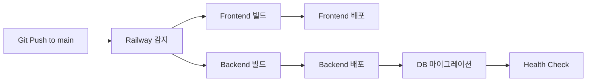

# Railway 배포 가이드

## 프로젝트 구조

이 프로젝트는 Monorepo 구조로, Frontend와 Backend를 분리하여 배포합니다.

```
gongjakso-tft/
├── frontend/          # Next.js 15 (Port 3000)
│   └── railway.json
├── backend/           # FastAPI (Port 8000)
│   └── railway.json
└── docker-compose.yml # 로컬 개발용
```

---

## Railway 배포 단계

### 1️⃣ PostgreSQL 데이터베이스 생성

1. Railway 대시보드에서 **"New"** → **"Database"** → **"PostgreSQL"** 선택
2. 데이터베이스 이름: `gongjakso-tft-db`
3. 자동으로 생성된 `DATABASE_URL` 환경 변수 확인

---

### 2️⃣ Backend 서비스 생성

1. **"New"** → **"GitHub Repo"** 선택
2. 저장소: `jeromwolf/gongjakso-tft` 선택
3. 서비스 이름: `gongjakso-tft-backend`

#### Backend 설정

**Settings → General:**
- **Root Directory**: `backend`
- **Build Command**: (자동 감지)
- **Start Command**: `uvicorn main:app --host 0.0.0.0 --port $PORT`

**Settings → Variables (환경 변수):**
```bash
# Database
DATABASE_URL=${{Postgres.DATABASE_URL}}

# Security
SECRET_KEY=<랜덤 생성: openssl rand -hex 32>
ACCESS_TOKEN_EXPIRE_MINUTES=30

# CORS
CORS_ORIGINS=["https://gongjakso-tft.up.railway.app","http://localhost:3000"]

# AI Services
ANTHROPIC_API_KEY=<Anthropic API Key>
OPENAI_API_KEY=<OpenAI API Key (Optional)>

# Email
RESEND_API_KEY=<Resend API Key>
EMAIL_FROM=Gongjakso TFT <noreply@gongjakso-tft.up.railway.app>

# App Info
APP_NAME=Gongjakso TFT Backend
APP_VERSION=1.0.0
```

**Settings → Networking:**
- Public Networking 활성화
- 생성된 도메인 복사 (예: `backend-production-xxxx.up.railway.app`)

---

### 3️⃣ Frontend 서비스 생성

1. **"New"** → **"GitHub Repo"** 선택
2. 저장소: `jeromwolf/gongjakso-tft` 선택
3. 서비스 이름: `gongjakso-tft-frontend`

#### Frontend 설정

**Settings → General:**
- **Root Directory**: `frontend`
- **Build Command**: `npm run build`
- **Start Command**: `npm start`

**Settings → Variables (환경 변수):**
```bash
# Backend API URL (2️⃣에서 복사한 Backend 도메인)
NEXT_PUBLIC_API_URL=https://backend-production-xxxx.up.railway.app

# Production 모드
NODE_ENV=production
```

**Settings → Domains:**
- Custom Domain 추가: `gongjakso-tft.up.railway.app` (기존 도메인 유지)

---

### 4️⃣ 서비스 연결 확인

```
Frontend (https://gongjakso-tft.up.railway.app)
   ↓ (API 호출)
Backend (https://backend-production-xxxx.up.railway.app)
   ↓ (DB 연결)
PostgreSQL
```

---

## 환경 변수 체크리스트

### Backend 필수 환경 변수
- [x] `DATABASE_URL` - PostgreSQL 연결 (자동)
- [x] `SECRET_KEY` - JWT 시크릿 키
- [x] `ANTHROPIC_API_KEY` - AI 콘텐츠 생성
- [x] `RESEND_API_KEY` - 이메일 발송
- [x] `CORS_ORIGINS` - Frontend 도메인 허용

### Frontend 필수 환경 변수
- [x] `NEXT_PUBLIC_API_URL` - Backend API URL

---

## 배포 플로우



---

## Health Check 확인

### Backend Health Check
```bash
curl https://backend-production-xxxx.up.railway.app/api/health
```

**응답:**
```json
{
  "status": "healthy",
  "message": "All systems operational",
  "database": "connected"
}
```

### Frontend Health Check
```bash
curl https://gongjakso-tft.up.railway.app
```

---

## 로그 확인

### Backend 로그
```
🚀 Starting Gongjakso TFT Backend...
Database URL: postgresql://...
✅ Database tables created
INFO:     Application startup complete.
```

### Frontend 로그
```
▲ Next.js 15.5.4
- Local:        http://0.0.0.0:3000
- Network:      http://0.0.0.0:3000

✓ Ready in Xms
```

---

## 트러블슈팅

### 1. Backend가 Frontend를 인식하지 못함
→ Backend의 `CORS_ORIGINS`에 Frontend 도메인 추가

### 2. Database 연결 실패
→ PostgreSQL 서비스가 실행 중인지 확인
→ `DATABASE_URL` 환경 변수가 올바른지 확인

### 3. AI 기능 작동 안 함
→ `ANTHROPIC_API_KEY` 환경 변수 확인
→ Anthropic 계정에 크레딧이 있는지 확인

### 4. 이메일 발송 실패
→ `RESEND_API_KEY` 환경 변수 확인
→ Resend 대시보드에서 도메인 인증 확인

---

## 보안 체크리스트

- [ ] `.env` 파일을 `.gitignore`에 추가 (✅ 완료)
- [ ] Railway 환경 변수에만 API 키 저장
- [ ] HTTPS 사용 (Railway 자동 제공)
- [ ] CORS 도메인 제한
- [ ] Admin 권한 테스트

---

## 참고 자료

- Railway 공식 문서: https://docs.railway.app
- Next.js 배포: https://nextjs.org/docs/deployment
- FastAPI 배포: https://fastapi.tiangolo.com/deployment/

---

**마지막 업데이트**: 2025-10-03
